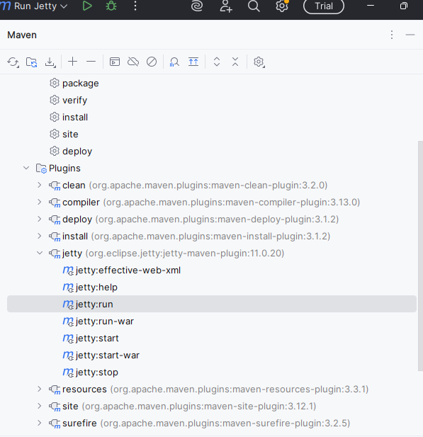

# 📒 Phonebook Portal (Vaadin + Jetty + MySQL)

A simple **Phonebook Management Portal** built with **Vaadin (no Spring)**, running on **Jetty** with **MySQL database integration**.  
The application supports **CRUD operations (Create, Read, Update, Delete)**, **search filters**, and **form validation**.

---

##  Features

- **Contact Management**
    - Add, edit, and delete contacts.
    - Fields: Name, Phone (unique), Email, Country, City, Street.
- **Search & Filters**
    - Search across all columns with per-column filters.
- **Validation**
    - Required fields enforced (Name, Phone).
    - Phone must be numeric and unique.
    - Email format validated.
    - Multi-user feature with last_updated column db based.
- **UI**
    - Vaadin CRUD Component used.
    - Responsive popup form for editing.
    - Inline validation messages.
    - Delete confirmation dialog.
- **Persistence**
    - In-memory repository (for quick testing).
    - JDBC repository with **MySQL database**.
- **Switch**
    - **For Database Mode**: Set the **useDatabase** flag to **true** in MainView Class to run the application with a database backend.
    - **For In-Memory Mode**: Set the **useDatabase** flag to **false** MainView Class to run the application with in-memory persistence.

---

## 🛠️ Prerequisites & Tech Stack

- **Java 17** (required for Vaadin 24)
- **Maven**
- **MySQL Server** + **MySQL Workbench**
- **IDE**: IntelliJ IDEA (recommended)
- **Frontend + Backend**: [Vaadin Flow 24](https://vaadin.com/docs/latest/)
- **Server**: Jetty
- **Build Tool**: Maven

---

## ⚙️ Project Setup

1. Clone the repository:
   ```bash
   git clone https://github.com/mabdullah-001/phonebook-portal
   cd Without-broadcaster-multiuser
   ```

2. Build the project:
   ```bash
   mvn clean install
   ```

3. Run the application:
   ```bash
   mvn jetty:run
   ```

4. Open in browser: 👉 [http://localhost:8080](http://localhost:8080)

---

## 🗄️ Database Setup

**Database Name:** `phonebook_db`

In case you want to change database connection details, update the variables inside the **Database.java** class:

```java
private static final String URL = "jdbc:mysql://localhost:3306/phonebook_db";
private static final String USER = "root";
private static final String PASSWORD = "root";
```

Run the following in **MySQL Workbench**:

```sql
CREATE TABLE `contacts` (
    `id` int NOT NULL AUTO_INCREMENT,
    `name` varchar(100) NOT NULL,
    `phone` varchar(20) NOT NULL,
    `email` varchar(100) DEFAULT NULL,
    `country` varchar(100) DEFAULT NULL,
    `city` varchar(100) DEFAULT NULL,
    `street` varchar(255) DEFAULT NULL,
    `last_updated` datetime(3) NOT NULL,
    PRIMARY KEY (`id`),
    UNIQUE KEY `phone` (`phone`),
    UNIQUE KEY `unique_phone` (`phone`)
) ENGINE=InnoDB AUTO_INCREMENT=103 DEFAULT CHARSET=utf8mb4 COLLATE=utf8mb4_0900_ai_ci;

```

---

## 📸 Screenshots

- **Main Application UI**
- 
  

- **Running via Maven Jetty**
- 
  

---

## 🧪 Testing Libraries

This project uses the following libraries for unit and integration testing:

- [**JUnit 5**](https://junit.org/junit5/) – The standard framework for writing unit tests in Java.
- [**Mockito**](https://site.mockito.org/) – Used for mocking dependencies, simulating behavior, and verifying method interactions.

### 🔍 Usage in the Project

- **JUnit 5** is used to write and run all test cases.
- **Mockito** is used to:
    - Mock DAO/repository classes in service layer tests.
    - Simulate data conflicts and concurrent updates.
    - Verify interactions (e.g., checking if a method was called).

### 🧪 How to Run Tests

You can run the tests using Maven:

```bash
mvn test
```

---
