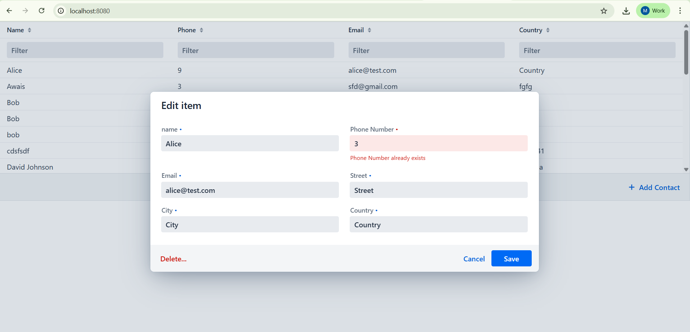

# 📒 Phonebook Portal (Vaadin + Jetty + MySQL)

A simple **Phonebook Management Portal** built with **Vaadin (no Spring)**, running on **Jetty** with **MySQL database integration**.  
The application supports **CRUD operations (Create, Read, Update, Delete)**, **search filters**, and **form validation**.

---

##  Features

- **Contact Management**
    - Add, edit, and delete contacts.
    - Fields: Name, Phone (unique), Email, Country, City, Street.
- **Search & Filters**
    - Search across all columns with per-column filters.
- **Validation**
    - Required fields enforced (Name, Phone).
    - Phone must be numeric and unique.
    - Email format validated.
    - Multi-user feature with last_updated column db based.
- **UI**
    - Vaadin CRUD Component used.
    - Responsive popup form for editing.
    - Inline validation messages.
    - Delete confirmation dialog.
- **Persistence**
    - In-memory repository (for quick testing).
    - JDBC repository with **MySQL database**.
- **Switch**
  - **For Database Mode**: Set the **useDatabase** flag to **true** in MainView Class to run the application with a database backend.
  - **For In-Memory Mode**: Set the **useDatabase** flag to **false** MainView Class to run the application with in-memory persistence.
---

## 🛠️ Tech Stack

- **Frontend + Backend**: [Vaadin Flow 24](https://vaadin.com/docs/latest/)
- **Server**: Jetty
- **Database**: MySQL
- **Build Tool**: Maven
- **IDE**: IntelliJ IDEA (recommended)

---

## ⚙️ Setup Instructions

### 1. Prerequisites
- Install **Java 17** (required for Vaadin 24).
- Install **Maven**.
- Install **MySQL Server** + **MySQL Workbench**.
- (Optional) IntelliJ IDEA with the **Database Tools** plugin.

---
## 🧪 Testing Libraries

This project uses the following libraries for unit and integration testing:

- [**JUnit 5**](https://junit.org/junit5/) – The standard framework for writing unit tests in Java.
- [**Mockito**](https://site.mockito.org/) – Used for mocking dependencies, simulating behavior, and verifying method interactions.

### 🔍 Usage in the Project

- **JUnit 5** is used to write and run all test cases.
- **Mockito** is used to:
    - Mock DAO/repository classes in service layer tests.
    - Simulate data conflicts and concurrent updates.
    - Verify interactions (e.g., checking if a method was called).

### 🧪 How to Run Tests

You can run the tests using Maven:

```bash
mvn test
   ```
### 2. Database Setup

Run the following in **MySQL Workbench**:

```sql
CREATE TABLE `contacts` (
  `id` int NOT NULL AUTO_INCREMENT,
  `name` varchar(100) NOT NULL,
  `phone` varchar(20) NOT NULL,
  `email` varchar(100) DEFAULT NULL,
  `country` varchar(100) DEFAULT NULL,
  `city` varchar(100) DEFAULT NULL,
  `street` varchar(255) DEFAULT NULL,
  `last_updated` timestamp NULL DEFAULT CURRENT_TIMESTAMP ON UPDATE CURRENT_TIMESTAMP,
  PRIMARY KEY (`id`),
  UNIQUE KEY `phone` (`phone`),
  UNIQUE KEY `unique_phone` (`phone`)
) ENGINE=InnoDB AUTO_INCREMENT=80 DEFAULT CHARSET=utf8mb4 COLLATE=utf8mb4_0900_ai_ci;


## 💻 OS-Specific Setup & Run Guide

### 🪟 Windows
1. Install **MySQL Server + Workbench** using the [MySQL Installer](https://dev.mysql.com/downloads/installer/).
2. MySQL usually starts automatically (check **Services** if not).
3. Clone the repository:
   ```powershell
   git clone https://github.com/your-username/phonebook-portal.git
   cd phonebook-portal
   ```
4. Build the project:
   ```powershell
   mvn clean install
   ```
5. Run the application:
   ```powershell
   mvn jetty:run
   ```
6. Open in browser: 👉 [http://localhost:8080](http://localhost:8080)
7. Run tests:
   ```powershell
   mvn test
   ```

---

### 🍏 macOS
1. Install dependencies via [Homebrew](https://brew.sh/):
   ```bash
   brew install openjdk@17 maven mysql
   ```
2. Start MySQL service:
   ```bash
   brew services start mysql
   ```
3. Clone the repository:
   ```bash
   git clone https://github.com/your-username/phonebook-portal.git
   cd phonebook-portal
   ```
4. Build the project:
   ```bash
   mvn clean install
   ```
5. Run the application:
   ```bash
   mvn jetty:run
   ```
6. Open in browser: 👉 [http://localhost:8080](http://localhost:8080)
7. Run tests:
   ```bash
   mvn test
   ```

---

### 🐧 Linux (Ubuntu/Debian)
1. Install dependencies:
   ```bash
   sudo apt update
   sudo apt install openjdk-17-jdk maven mysql-server
   ```
2. Start MySQL service:
   ```bash
   sudo service mysql start
   ```
3. Clone the repository:
   ```bash
   git clone https://github.com/your-username/phonebook-portal.git
   cd phonebook-portal
   ```
4. Build the project:
   ```bash
   mvn clean install
   ```
5. Run the application:
   ```bash
   mvn jetty:run
   ```
6. Open in browser: 👉 [http://localhost:8080](http://localhost:8080)
7. Run tests:
   ```bash
   mvn test
   ```


## 📸 Screenshots

Here’s a preview of the Phonebook Portal:


---